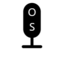

# OpenSpeak: Free, Open-Source Voice-to-Text for Windows



**OpenSpeak is a free, powerful, and privacy-focused dictation tool that brings seamless voice typing to any application on your Windows PC. Powered by OpenAI's Whisper, it offers fast, accurate speech-to-text transcription on your own LOCAL machine. This is a FREE SuperWhisper / WhisperType replacement for Windows.**

---

## Why Choose OpenSpeak?

*   🎤 **Universal Voice Typing**: Dictate in Microsoft Word, Notepad, your web browser, and anywhere else you can type.
*   🔒 **You Control Your Data**: Choose between two powerful transcription engines:
    *   **Local Transcription**: Runs 100% offline for maximum privacy. Requires a one-time download of transcription libraries from within the app. Supports GPU (NVIDIA/CUDA) for a significant speed boost.
    *   **OpenAI API**: Uses the latest `whisper` model for cutting-edge accuracy via the cloud.
*   🚀 **Flexible & Fast**: Activate via "Hold-to-Talk" for quick commands or "Toggle-to-Talk" for longer dictation.
*   ⚙️ **Simple & Smart Setup**: No complex installation required. The app guides you on first launch to choose your transcription engine. If you select "Local", the necessary libraries (~2.5 GB) are downloaded and installed automatically.
*   👀 **Movable Status Indicator**: A draggable on-screen indicator always shows the app's current status (Idle, Listening, Thinking).
*   ❤️ **Free & Open Source**: OpenSpeak is completely free and built by the community. No ads, no subscriptions.

---

## Quick Start (CPU-only)

1. Install Python 3.10+ and Git
2. Clone the repo and create a virtual-env
```powershell
 git clone https://github.com/your-username/openspeak.git
 cd openspeak
 python -m venv venv
 .\venv\Scripts\activate
```
3. Install **runtime** requirements (CPU versions):
```powershell
pip install -r requirements.txt
```
4. Run
```powershell
python main.py
```

> ℹ️  If you later want GPU acceleration, open the Settings window and click **Install Dependencies** under the Local tab – the correct PyTorch + CUDA wheels will be downloaded automatically.

### Administrator privileges
Global hotkey capture on Windows sometimes needs Administrator rights. If your chosen hotkey is not detected, **run PowerShell / the `.exe` as Administrator** and try again.

### Troubleshooting
| Problem | Fix |
|---------|-----|
| Hotkey not captured | Use a non-reserved combo (`Ctrl+Shift+S`, `F10`, etc.) or run as Admin |
| Mic not detected | Check Windows Privacy Settings → Microphone |
| Local model download slow | Make sure you have at least 3 GB free disk & stable internet |

## License
This project is licensed under the MIT License - see the [LICENSE](LICENSE) file for details.

### Configuration

OpenSpeak stores its preferences in a plain-text file named `config.ini` located next to `main.py` (the Settings window is just a friendly GUI on top of that file). You can **either** use the Settings window **or** edit the file manually if you need to script/automate deployments.

| Section / Key | What it does | Example |
|---------------|-------------|---------|
| `[General]` `hotkey` | Global hotkey that starts/stops dictation.  Any string accepted by the [keyboard](https://github.com/boppreh/keyboard) library works &mdash; e.g. `right shift`, `ctrl+alt+s`, `f9`. | `hotkey = ctrl+space` |
| `[General]` `hotkey_mode` | `hold` = press-and-hold, `toggle` = press once to start, again to stop. | `hotkey_mode = toggle` |
| `[General]` `device` | `cpu` or `cuda`.  GPU requires the CUDA toolkit & the in-app *Install Dependencies* step. | `device = cuda` |
| `[Local]` `model_size` | Whisper model to load locally.  One of `tiny.en`, `base.en`, `small.en`, `medium.en`.  Bigger models = better accuracy & more VRAM. | `model_size = medium.en` |
| `[OpenAI]` `api_key` | Your OpenAI key if you prefer cloud transcription. Leave blank to disable. | `api_key = sk-...` |

> After editing `config.ini` manually, restart OpenSpeak (or use **File → Reload Config** when running from source) so changes take effect.

#### Adding new transcription back-ends

The code is designed so that any class with a `transcribe_audio(numpy_audio)->str` method can be plugged in.  Example skeleton:

```python
class MyFancyTranscriber:
    def __init__(self, **kwargs):
        ...
    def transcribe_audio(self, audio_data):
        return "text"
```

Register it in `app.py` under the engine-selection branch or add an `AbstractTranscriber` base class and use dependency-injection.

#### Hotkey combination syntax

OpenSpeak uses the `keyboard` library; combos are written as <kbd>+</kbd>-separated key names:

```
ctrl+shift+s      # works
left alt+space    # works (use left/right prefixes)
win+space         # ⚠ Windows reserves this combo, prefer ctrl+win+space
```

Refer to <https://github.com/boppreh/keyboard#keyboard-key-names> for the complete list.

### Desktop shortcut / batch file

If you prefer one-click starting:
1. Copy `start_openspeak.bat` from this repo to your Desktop.
2. Open it in Notepad and change the line
   ```bat
   set "OPEN_SPEAK_DIR=C:\Path\to\OpenSpeak"
   ```
   so it points to the folder that contains `main.py` (where you ran the quick-start commands).
3. Double-click the batch file – OpenSpeak launches and sits in the system-tray.

Tip: Right-click → Properties → `Run: Minimized` so the console window stays hidden.

--- 
